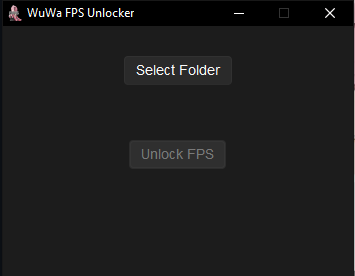
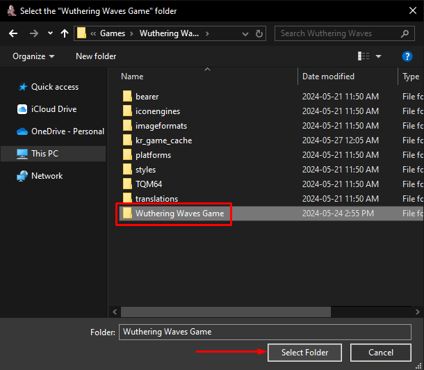
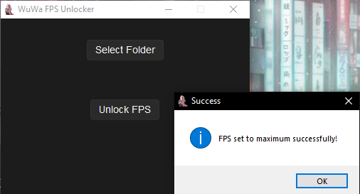

# Wuthering Waves FPS Unlocker
A simple frame rate modifying tool for the new Action RPG release, [Wuthering Waves](https://wutheringwaves.kurogames.com) by Kuro Games.

### Warning ⚠ : This tool **DOES** modify certain game files, and with this, it's use may carry the risk of punishment. By downloading this tool you understand and accept any risks, and are responsible for any and all consequences.

## Instructions
1. Head over to the [releases](https://github.com/wakeupaj/wuwafpsunlocker/releases/) section on this repository, and download the latest release titled: "WuWa_FPS_Unlocker.zip
".
2. Once installed, open *(or extract if you prefer)* the .zip file, and launch "**WuWa FPS Unlocker.exe**"
3. Wait for the file to open, and once it has you should be greeted with this interface: 

4. Proceed by clicking on "**Select Folder**" and navigate to your Wuthering Waves installation directory. It may look something like this:
`D:\Games\Wuthering Waves\Wuthering Waves Game`

**It is important that you select the folder titled "Wuthering Waves Game" and NOT just "Wuthering Waves".**

5. After navigating to "Wuthering Waves Game", you may click select folder.

6. Finally, click on "Unlock FPS". Upon succession you will be presented with an pop-up window that looks something like this:

### That's all! Your in-game framerate should now be uncapped from 60 FPS, and you can now experience Wuthering Waves in an brand new and ultra smooth way. Enjoy!

#### Please note! - This game is hard limited to run at 120 FPS, even after modifying game files. For this reason, this program will not include an FPS selector, and will instead set your game to the maximum possible frame rate.

